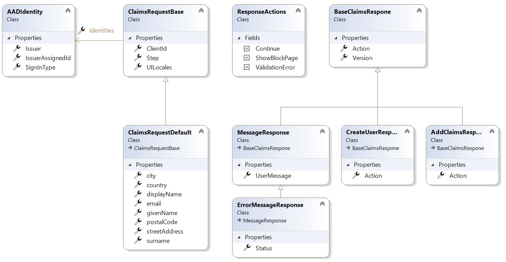

# SpectoLogic.Identity.AADB2C.APIConnectors

## General

Azure Active Directory B2C offers the functionality to plug API-Connectors into the sign-up user flows to customize and extend claims.

You can read more about API-Connectors [here](https://docs.microsoft.com/en-us/azure/active-directory-b2c/api-connectors-overview?pivots=b2c-user-flow) and here:

- [Modify sign-up experience](https://docs.microsoft.com/en-us/azure/active-directory-b2c/add-api-connector?pivots=b2c-user-flow)
- [Enrich tokens with external claims](https://docs.microsoft.com/en-us/azure/active-directory-b2c/add-api-connector-token-enrichment?pivots=b2c-user-flow)
- [Secure an API connector](https://docs.microsoft.com/en-us/azure/active-directory-b2c/secure-rest-api?tabs=windows&pivots=b2c-user-flow)

Especially when you are dealing with custom user attributes you have to be careful to get the serialization of the claim attributes right, because otherwise they will be simply ignored.

The extensions attributes are provided and must be returned in the following format:

- **extension_&lt;extensions-app-id&gt;_CustomAttribute1**

Especially when it come to the Extension-App-ID make sure it is 
- lowercase
- you have removed all hypens

## Library, Code Generator and usage

This library and its classes and extension method should help you to reduce your effort building request/response classes with custom attributes.

This repository also includes a sample API Connector built as Azure function and shows how to use the library and code generator with custom attributes.

## Class Overview


The **ClaimsRequestBase** contains the base properties that are sent by AADB2C and it's inherted **ClaimsRequestDefault** also contains some built-in properties. You should inherit your incomming **ClaimsRequest** from those classes. You then can add custom properties by adding the attributes "**ExtensionAppId**" and multiple "**CustomClaim**" attributes which will generate properties with the correct naming in the JsonProperty.

**Example:**
```csharp
// Client-ID of AAD-App "b2c-extensions-app. Do not modify. Used by AADB2C for storing user data."
[ExtensionAppId("EFF3e2b4-6308-437e-953f-95fec3dc1573")]
[CustomClaim("ADACId", typeof(string))]
[CustomClaim("PhoneNumber", typeof(string))]
public partial class MyClaimsRequest : ClaimsRequestBase // ClaimsRequestDefault
{
}
```

You also will build you Response-Classes in a simmilar way by just inheriting them from either **BaseClaimsResponse** or **CreateUserResponse** / **AddClaimsResponse**. The two latter just set the Action to "Continue". If you encounter an error or want to send back a message to the userflow you can use **MessageResponse** or **ErrorMessageResponse**.

**Example retrieving a Claims - Request**
```csharp
[FunctionName("CreateUser")]
public async Task<IActionResult> CreateUser(
    [HttpTrigger(AuthorizationLevel.Anonymous, "post", Route = null)] HttpRequest req,
    ILogger log)
{
    ... 
    // Use the extension method to retrieve the Claims request from the body
    var claimsReq = await req.Body.GetClaimsRequestAsync<MyClaimsRequest>();
    var phoneNumber = claimsReq.PhoneNumber;
   ... 
```
**Example sending a Claims - Response**
```csharp
return new OkObjectResult(
    new MyClaimsResponse()
    {
        ADACId = Guid.NewGuid().ToString("D"),
        PhoneNumber = phoneNumber
    })
{
    StatusCode = 200
};
```

**Example sending Message Responses**
```csharp
var msgResponse = new MessageResponse()
{
    Action = ResponseActions.ShowBlockPage,
    UserMessage = "There was a problem with your request. You are not able to sign up at this time."
};
return new BadRequestObjectResult(msgResponse);

var msgResponse = new ErrorMessageResponse()
{
    Action = ResponseActions.ValidationError,
    UserMessage = errorMessage
};
return new BadRequestObjectResult(msgResponse);
```
